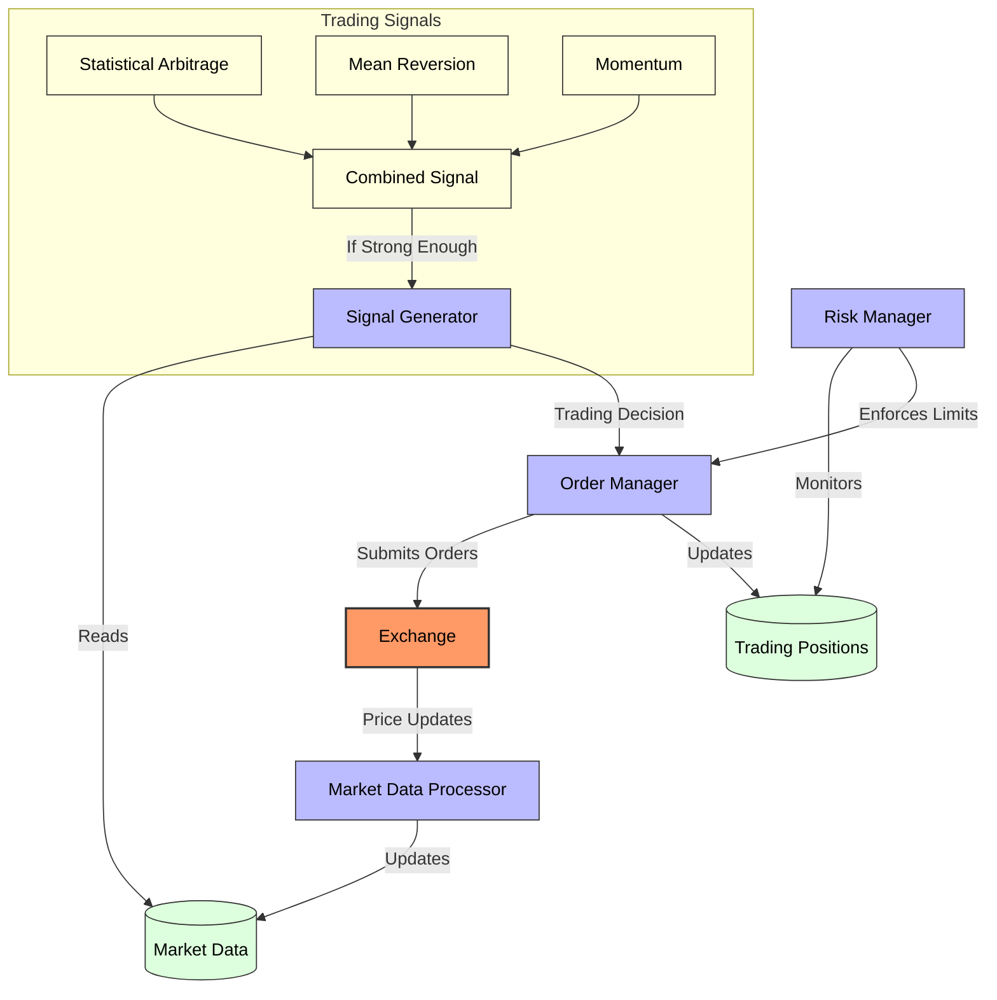
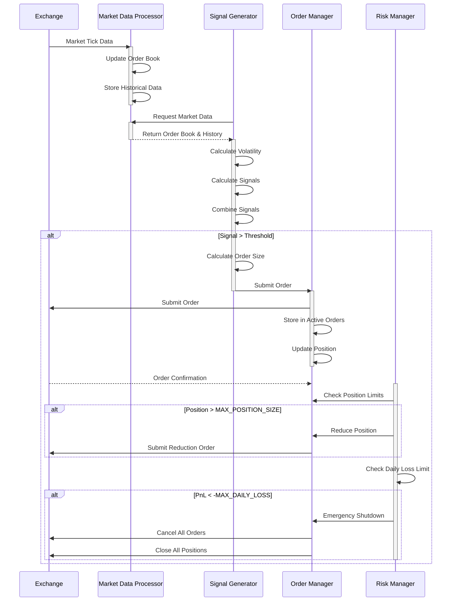

# HFT Algorithm Implementation

A Spring Boot application that implements the core components of algorithmic trading systems with a focus on high-frequency trading (HFT) concepts. This project provides a framework and API for algorithmic trading strategies, signal generation, and risk management.

## What is Algorithmic Trading and HFT?

**Algorithmic Trading** is the use of computer programs to automate trading decisions and execution based on predefined rules. 

**High-Frequency Trading (HFT)** is a specialized subset of algorithmic trading characterized by:

- **Extremely high speed**: Executing orders in microseconds or milliseconds
- **High volume**: Generating thousands or millions of orders per day
- **Short holding periods**: Often holding positions for seconds or less
- **Tiny profit margins**: Making very small profits per trade but at high volume

Algorithms analyze market data to identify patterns and execute trades faster than humanly possible, typically seeking to profit from small price discrepancies that may exist for only fractions of a second.

### Algorithmic Trading Strategies (Implemented in this project)

1. **Statistical Arbitrage**: Exploiting price differences between related assets
2. **Mean Reversion**: Trading on the assumption that prices will return to their average
3. **Momentum**: Following short-term price trends

This project implements these strategies in a simplified form to demonstrate the core concepts of algorithmic trading systems.

## About This Project

This project is an educational implementation of algorithmic trading concepts with a focus on HFT principles. It's important to note that this is not a production-ready HFT system, which would require:

- Ultra-low latency network connections and specialized hardware
- Co-location with exchange servers
- Hardware acceleration (FPGAs, specialized NICs)
- Extremely optimized code (often in C++ or even assembly)
- Microsecond-level timing precision

Instead, this project demonstrates the fundamental architecture and components of an algorithmic trading system through a Spring Boot application with a REST API interface. It can be used for learning, prototyping strategies, and as a starting point for more sophisticated implementations.

### Core Components



### Processing Flow



## Features

* **Multi-strategy signal generation**: Combines statistical arbitrage, mean reversion, and momentum strategies
* **Real-time market data processing**: Processes and stores order book updates in real-time
* **Comprehensive risk management**: Enforces position limits and implements loss-limiting safeguards
* **REST API**: Control and monitor the algorithm through HTTP endpoints
* **Spring Boot implementation**: Built on the robust Spring framework

## API Endpoints

| Method | Endpoint | Description |
|--------|----------|-------------|
| POST | `/api/algorithm/start` | Start the trading algorithm |
| POST | `/api/algorithm/stop` | Stop the trading algorithm |
| GET | `/api/algorithm/status` | Check if the algorithm is running |
| GET | `/api/algorithm/positions` | Get current positions and P&L |
| GET | `/api/algorithm/orderbooks` | Get current order book data |
| GET | `/api/algorithm/performance` | Get performance metrics |
| POST | `/api/algorithm/updatemarket` | Update market data (testing) |
| POST | `/api/algorithm/addsymbol` | Add a new symbol to track |

## Quick Start

1. **Clone the Repository**

   ```bash
   git clone https://github.com/yourusername/hft-application.git
   cd hft-application
   ```

2. **Build the Application**

   ```bash
   ./mvnw clean package
   ```

3. **Run the Application**

   ```bash
   java -jar target/hft-application-1.0.0.jar
   ```

4. **Start the Algorithm**

   ```bash
   curl -X POST http://localhost:8080/api/algorithm/start
   ```

5. **Check Algorithm Status**

   ```bash
   curl http://localhost:8080/api/algorithm/status
   ```


## Default Symbols

The application comes preconfigured with the following symbols:

- **BTC-USD** (Bitcoin)
- **ETH-USD** (Ethereum)
- **SOL-USD** (Solana)

Additional symbols can be added through the API.

## Contributing

Contributions are welcome! Please feel free to submit a Pull Request.
